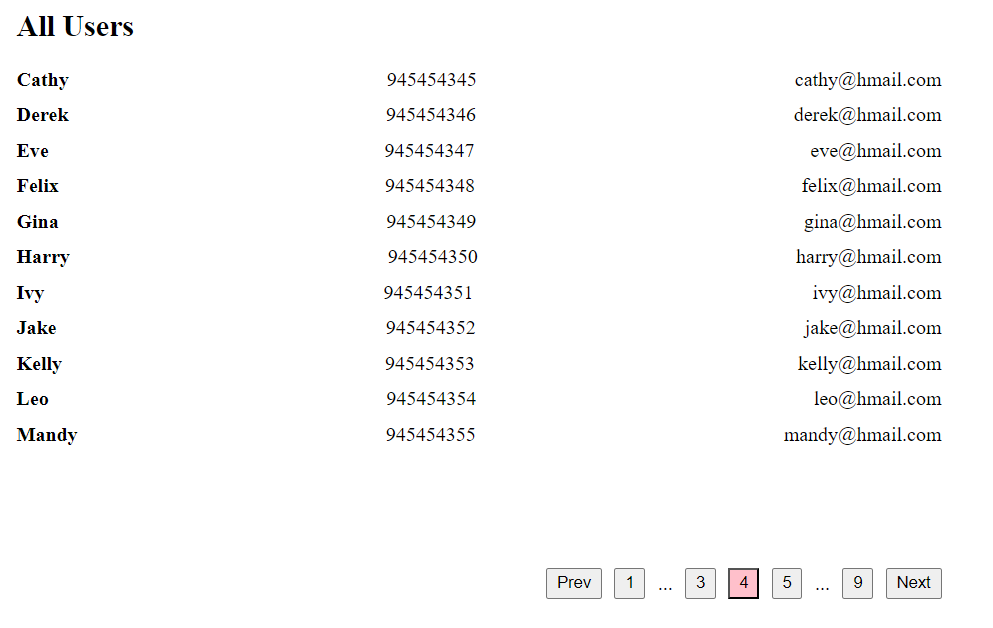

# Pagination Component

This project implements a reusable `Pagination` component in React that allows users to display the active page and navigate between multiple pages.

## Preview



## Usage

To use the `Pagination` component in your project, you can include it as shown in the example below:

```tsx
function App() {
  const [offset, setOffset] = useState<number>(1);
  const totalPages = 50;

  function updateOffset(userSelctedOffset: number) {
    setOffset(userSelctedOffset);
  }

  return <Pagination totalPages={pagesCount} onChange={updateOffset} />;
}

export default App;
```

## Props

The `Pagination` component accepts the following props:

- **`totalPages: number`**: The total number of pages.
- **`onChange: (pageNumber: number) => void`**: A callback function that is called with the selected page number whenever the user navigates to a different page.

```typescript
export type PaginationProps = {
  totalPages: number;
  onChange: (pageNumber: number) => void;
};
```

## Installation

- Pull this branch into your local system.
- Make sure you have Node installed (preferrably Node v20.11.1).
- Navigate to the project directory and run
  ```
  npm install
  ```
- Once all the dependencies have been installed, run the following command to start the dev server.
  ```
  npm run dev
  ```
